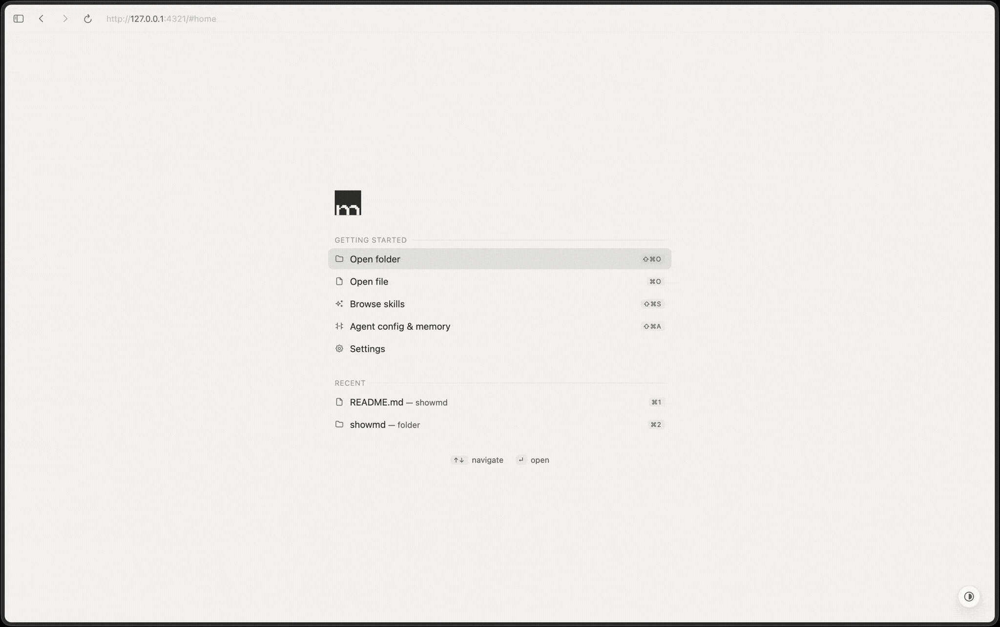

# showmd
Read and edit markdown in your browser.

```sh
npx showmd-cli
```

showmd serves a folder of markdown files to your browser: a rendered reading view with folder navigation, an inline editor that renders code, math, and diagrams as you type, a version history of every save, and a browser for the skills, instructions, and memory files your AI agents run on. It runs on localhost with a single runtime dependency, and nothing you write leaves your machine.



## Features

**Three views of one document.** Read Mode is the rendered page: highlighted code, KaTeX math, Mermaid diagrams, tables, task lists. Edit Mode turns that same page into an editor that renders formatting as you type, and Source Mode shows the raw markdown with nothing hidden. One keystroke cycles through them.

**Agents write markdown, showmd renders it.** Coding agents produce a lot of it: plans, reviews, research notes. showmd ships a cross-agent skill ([`skills/showmd/SKILL.md`](skills/showmd/SKILL.md)) that teaches them to open what they write in your browser instead of leaving it to scroll past in the terminal. It installs into shared skill directories like `~/.agents/skills`, so Claude Code, Codex, and any agent that reads them pick it up ([how to install](#agent-skill)).

**Read what your agents remember.** `showmd agents` renders their global instructions, rules, and per-project memory files; `showmd skills` shows every skill installed on your machine and which agents can see it. When an agent has something wrong, fix it right there in Edit Mode: every save is versioned, so you can diff your fix against what the agent wrote.

**History.** showmd tracks your documents' existing git history and adds an offline save history of its own: every save becomes a version in a git repository kept outside the folder you are serving, so your files and your repo stay untouched. Browse and diff past versions in the info panel.

**Everything you expect from a markdown editor.** A slash menu for switching block types, a floating toolbar for formatting, folder navigation in the sidebar, light and dark themes, and a page that reloads whenever a file changes on disk.

**Zero setup.** Node 20 or newer and one runtime dependency. `npx showmd-cli` needs no install and there is nothing to configure.

**Local only.** The server binds to 127.0.0.1. Your files never leave your machine, and everything works offline.

## Install

| Command | What you get |
|---|---|
| `npx showmd-cli` | No install. Always the latest version, slower first run. Any OS with Node 20 or newer. |
| `npm i -g showmd-cli` | A `showmd` command on your `PATH`. Any OS with Node 20 or newer. Update with `npm update -g showmd-cli`. |
| `brew install l0kyurue1/tap/showmd` | The same command, managed by Homebrew (macOS and Linux). Update with `brew upgrade`. |

The command is `showmd` once installed. Commands below are written that way; with
npx, prefix them as `npx showmd-cli …`.

### Desktop app

Needs a global install first (`npm i -g showmd-cli` or Homebrew): the npx cache is
cleared periodically and an app made from it breaks.

```sh
showmd install-app
```

Adds a double-clickable app: `ShowMD.app` on macOS, a Start Menu shortcut
on Windows, a `.desktop` entry on Linux. Opening it opens your browser
straight to Home, where you pick a file or folder (with recents); no
terminal after the one-time install. On macOS, drop folders on the Dock icon
to serve several alongside; quitting the app stops them all. The app is
generated on your machine, never downloaded, so Gatekeeper and SmartScreen
have nothing to block.

### Agent skill

Installing showmd does not teach your agents to use it. The skill is a
separate one-time install:

```sh
npx skills add l0kyurue1/showmd --global
```

Pick the agents you want when prompted, or pass `--agent '*'` for all of
them. `npx skills list` shows what is installed, `npx skills remove showmd`
undoes it. This route works without showmd installed at all.

If you already have showmd, the same install runs from the copy on disk,
with no network and no npx:

```sh
showmd install-skill
```

It writes the skill to `~/.agents/skills/showmd` and links it into every
agent directory it finds on your machine. Pass `--copy` to write real files
instead of symlinks. Re-run it after an upgrade to refresh the skill.

### More integrations

[`contrib/`](contrib/README.md) holds two extras that `install-app` does not
cover: a Raycast script command for macOS, and a `.md` right-click entry for
Windows. Both need `showmd` on your `PATH`.

## Usage

### Serve markdown

```sh
showmd                # serve the current directory
showmd notes/         # serve a folder
showmd README.md      # open a single file
showmd --port 8080    # pick a port (default 4321; falls back to a free port if taken)
showmd --new          # start a new dedicated server instead of reusing a running one
showmd --no-open      # don't launch the browser
showmd --help         # every command and flag (-h)
showmd --version      # print the version (-v)
```

### Browse agent skills

```sh
showmd skills         # auto: project mode if cwd is a skills project, else all mode
showmd skills all     # every discovered project's skills, plus your global skills
showmd skills global  # just your global skills (~/.claude/skills, ~/.codex/skills, ...)
showmd skills <dir>   # project mode for the given dir(s)
```

`showmd skills` groups your Claude Code, Codex, and other agent skill directories (`~/.claude/skills`, project `.claude/skills`, `~/.claude/plugins/*/skills`, `~/.codex/skills`, `~/.agents/skills`) into one sidebar. `all` mode discovers other projects via Claude Code's `~/.claude.json` history plus a sibling-directory scan.

Detection reaches beyond those paths: 70+ agents (Cursor, Zed, Windsurf, Gemini CLI, GitHub Copilot, Goose and the rest, listed in `agent-registry.js`), and each skill is badged with the ones installed on your machine that can actually see it. Agents that read the shared `~/.agents/skills` store natively need no per-agent symlink to pick a skill up.

### Agent config & memory

```sh
showmd agents         # browse Claude Code / Codex instructions, rules, and memories
```

This shows global instructions like `~/.claude/CLAUDE.md` and `~/.codex/AGENTS.md`, their rules, and per-project memories. The app reaches the same view from the sidebar or a keyboard shortcut.

### Housekeeping

```sh
showmd prune <dir>    # delete saved history for a folder
showmd prune --all    # delete all saved history
```

## What showmd is not

A static site generator, a hosted service, or a note vault. It shows the markdown you already have and lets you fix it in place.
