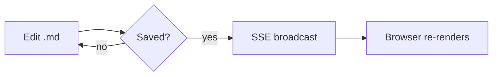

# SAMPLE.md — style reference

Everything showmd currently renders, in one file, for visual review. The block
above this paragraph is YAML frontmatter — it's stripped from this view and shown
instead as a Properties panel in the sidebar (open history with ⌘⇧H).

# Heading levels

# H1 heading
## H2 heading
### H3 heading
#### H4 heading
##### H5 heading
###### H6 heading

## Text formatting

**Bold text**, *italic text*, ***bold italic***, ~~strikethrough~~, and
==highlighted text== all in one paragraph. Also `inline code` for short snippets.

## Code block

```js
function hello(name) {
  return `Hello, ${name}!`;
}
```

```python
def hello(name):
    return f"Hello, {name}!"
```

```bash
echo "Hello, $1!"
```

## Mermaid diagram



## Math

Inline math sits right in a sentence, like $E = mc^2$, without breaking the flow.
Block math gets its own line:

$$
\int_0^\infty e^{-x^2} \, dx = \frac{\sqrt{\pi}}{2}
$$

## Blockquote

> A blockquote can span multiple lines and holds a quiet aside next to the
> main text.

> **Warning:** this will permanently delete all rows in the `users` table.
>
> ```sql
> DROP TABLE users;
> ```
>
> Verify a backup exists first.

## Callouts

> [!note]
> A note callout uses the default title.

> [!info]
> Info callouts surface context worth knowing before you proceed.

> [!tip] Ship the lazy version first
> Callouts can carry a custom title after the type marker.

> [!warning]
> Warning callouts stand out without shouting.

> [!danger]
> Danger callouts flag something that breaks if you ignore it.

> [!question]
> Are you sure this is the right approach?


## Lists

Unordered:
- First item
- Second item
  - Nested item

Ordered:
1. First step
2. Second step
3. Third step

Task list:
- [x] Done task
- [ ] Open task

## Table

| Format | Supported |
| --- | --- |
| Tables | ✓ |
| Task lists | ✓ |
| Highlights | ✓ |

## Horizontal rule

---

## Links & wikilinks

A regular [link to an external site](https://example.com).

A resolved wikilink: [[SAMPLE]] — points back to this file, since it's a valid
basename in the tree.

A resolved wikilink with an alias: [[SAMPLE|click here to loop back]].

An unresolved wikilink: [[nonexistent-page]] — renders muted, not clickable.

---

## Images

Standard markdown embeds a local file relative to the document:


To control the size, use an `` tag. Only `src`, `alt`, `title`, `width`,
`height` and `align` are kept; every other attribute is dropped.


Wrap it in `<p align="center">`, `<div align="center">` or an aligned heading to
center a logo block:

<p align="center">
  
</p>

<h3 align="center">showmd</h3>

Everything else stays escaped: `<script>`, `<iframe>`, `<a href>` and inline
event handlers render as literal text.
